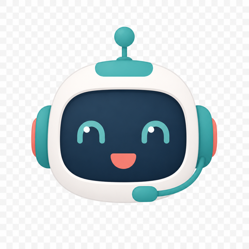

<p align="center">
  
</p>

# ai-voice-bot

**A self-hosted voice + chat greeter for your website.** Deploy your own Cloudflare Worker, sync your persona and knowledge, drop in a Shadow-DOM widget — visitors talk to *your* assistant, not a shared black box.

Fully yours. Your API keys, your allowlist, your leads, your knowledge. No hosted multi-tenant backend. Free Cloudflare Workers tier is enough for typical portfolio traffic.

> Think of it as a friendly receptionist that actually knows your resume — chat or tap-to-talk, neural voice replies, lead capture when someone wants to reach you.

```bash
# 1) Deploy Worker  2) Sync config  3) Embed widget
npx wrangler deploy
node scripts/sync-config.mjs --config ./mysite-config.json --context ./mysite-context.txt
```

```text
your-site/
└── <script> AiVoiceBotConfig.workerUrl = "https://voicebot.example.com"
         │
         ▼
Cloudflare Worker (yours)
├── secrets     GROQ_API_KEY, optional TTS / email keys
├── KV          app_config  → persona, origins, behavior
│               context     → knowledge blob
├── DO          session memory
└── D1          leads
```

## Install

**Requires:** Node.js 18+, a [Cloudflare](https://dash.cloudflare.com) account, a [Groq](https://console.groq.com) API key

```bash
git clone https://github.com/mohansagark/ai-voice-bot.git
cd ai-voice-bot/worker
npm install
npx wrangler login
```

Create bindings, then paste the IDs into `worker/wrangler.toml`:

```bash
npx wrangler d1 create ai-voice-bot-db
npx wrangler kv namespace create PORTFOLIO_KV
```

<details>
<summary><strong>wrangler.toml skeleton</strong></summary>

```toml
name = "ai-voice-bot"
main = "src/index.ts"
compatibility_date = "2024-09-01"
compatibility_flags = ["nodejs_compat"]

# Optional:
# routes = [{ pattern = "voicebot.example.com", custom_domain = true }]

[[d1_databases]]
binding = "DB"
database_name = "ai-voice-bot-db"
database_id = "YOUR_D1_DATABASE_ID"

[[kv_namespaces]]
binding = "PORTFOLIO_KV"
id = "YOUR_KV_NAMESPACE_ID"

[vars]
DEFAULT_PROVIDER = "groq"
MAX_MESSAGE_CHARS = "2000"
MAX_TURNS_PER_SESSION = "30"
MODE = "prod"
TTS_VOICE = "hannah"
MAX_TTS_CHARS = "1200"

[[durable_objects.bindings]]
name = "SESSION_DO"
class_name = "SessionDO"

[[migrations]]
tag = "v1"
new_sqlite_classes = ["SessionDO"]
```

Do **not** commit personal persona / allowlist into `[vars]` — those sync into KV.

</details>

**Local smoke test:**

```bash
cp .dev.vars.example .dev.vars   # GROQ_API_KEY=...  MODE=dev
npm test
npm run dev                      # http://localhost:8787
```

<details>
<summary><strong>Manual / one-shot production setup</strong></summary>

```bash
# Deploy code
npx wrangler deploy

# Secrets (interactive)
npx wrangler secret put GROQ_API_KEY
# optional: WEBHOOK_URL, OPENROUTER_API_KEY, DEEPGRAM_API_KEY,
#           RESEND_API_KEY, LEAD_NOTIFY_FROM, LEAD_NOTIFY_TO

# Site config (copy templates from config/)
cp ../config/site-config.template.json ../mysite-config.json
cp ../config/context.template.txt ../mysite-context.txt
# edit both files — set allowedOrigins to exact https://host values (no path/slash)

cd ..
node scripts/sync-config.mjs \
  --config ./mysite-config.json \
  --context ./mysite-context.txt \
  --secrets-from-env
```

**First-deploy order:** Worker → secrets → KV sync → confirm health.  
Until `app_config` is synced, production **fails closed** (`403` on browser chat).

```bash
curl -s https://YOUR_WORKER_URL/health
# healthy: "config":"kv", "origins": > 0
```

</details>

## Usage

**Embed (public config only — never API keys):**

```html
<script>
  window.AiVoiceBotConfig = {
    workerUrl: "https://YOUR_WORKER_URL",
    branding: {
      botName: "Leo",
      greeting: "Hi, I'm Leo — how can I help?"
    },
    voice: { enabled: true, speakByDefault: false }
  };
</script>
<script
  src="https://cdn.jsdelivr.net/npm/ai-voice-bot-widget@0.1.0/dist/ai-voice-bot.min.js"
  defer
></script>
```

Or build from source:

```bash
cd widget && npm install && npm run build
# → widget/dist/ai-voice-bot.min.js
```

**Update persona / knowledge without redeploying the Worker:**

```bash
node scripts/sync-config.mjs \
  --config ./mysite-config.json \
  --context ./mysite-context.txt
```

**Useful endpoints**

| Method | Path | Purpose |
|--------|------|---------|
| `GET` | `/health` | `config`, `origins`, provider, mode |
| `POST` | `/chat` | SSE agent replies |
| `POST` | `/tts` | Neural speech |
| `POST` | `/lead` | Direct lead capture |

Works with any host page that can load a script tag:

| Host | How |
|------|-----|
| Plain HTML | Script tags above |
| Next.js / React | Public env for `workerUrl` + client loader — see [`widget/README.md`](widget/README.md) |
| CMS-driven sites | Build `mysite-config.json` from your CMS; sync on production deploy |

## What you get

**Streaming chat** — LangGraph agent over SSE, session memory via Durable Objects

**Voice** — tap-to-talk (`SpeechRecognition`) + Groq neural TTS with browser TTS fallback

**Grounded answers** — persona facts + optional long-form `context` knowledge blob

**Lead capture** — agent tool + optional webhook / Resend email

**Fail-closed CORS** — only origins you sync; empty allowlist denies everyone in prod

**Shadow DOM widget** — ~5.5 KB gzipped, won't fight your site CSS

**Honest ops** — `/health` tells you `bootstrap` vs `kv` so you know if sync ran

Every browser-facing page only receives **public** config. LLM keys stay in Worker secrets.

## Production config template

```bash
cp config/site-config.template.json ./mysite-config.json
cp config/context.template.txt ./mysite-context.txt
```

| File | KV key | Contains |
|------|--------|----------|
| `mysite-config.json` | `app_config` | `allowedOrigins`, `persona`, `behavior`, `widget` |
| `mysite-context.txt` | `context` | Plain-text knowledge (projects, jobs, skills…) |

- Origins must be exact browser `Origin` values: `https://www.example.com` — **no path, no trailing slash**
- `mode` is a Worker env var only — not syncable (CMS cannot disable abuse guards)
- Schema: [`config/schema.json`](config/schema.json) · Storage map: [`config/STORAGE.md`](config/STORAGE.md)

<details>
<summary><strong>Minimal mysite-config.json shape</strong></summary>

```json
{
  "allowedOrigins": ["https://www.example.com", "https://example.com"],
  "persona": {
    "botName": "Leo",
    "owner": { "name": "Alex", "role": "Software Engineer" },
    "bio": "…",
    "tone": "warm, a little playful…",
    "facts": ["…"],
    "do_not": ["quote prices", "commit to dates", "schedule meetings"]
  },
  "widget": {
    "branding": {
      "botName": "Leo",
      "greeting": "Hi, I'm Leo — Alex's assistant."
    },
    "voice": { "enabled": true, "speakByDefault": false }
  }
}
```

</details>

## Tech stack

Cloudflare Workers + Durable Objects + KV + D1 · LangGraph.js · Groq (OpenAI-compatible) · Shadow DOM widget · optional Deepgram / OpenRouter / Resend. No Neo4j, no vector DB required for the default path.

| Piece | Path |
|-------|------|
| Worker | [`worker/`](worker/) |
| Widget (npm) | [`widget/`](widget/) · [`ai-voice-bot-widget`](https://www.npmjs.com/package/ai-voice-bot-widget) |
| Sync CLI | [`scripts/sync-config.mjs`](scripts/sync-config.mjs) |
| Templates | [`config/`](config/) |

<details>
<summary><strong>Troubleshooting</strong></summary>

| Symptom | Fix |
|---------|-----|
| `/health` → `"config":"bootstrap"` | Run `sync-config.mjs` |
| `origin not allowed` / widget hiccup | Add exact origin; re-sync |
| No neural voice | Accept [Orpheus terms](https://console.groq.com/playground?model=canopylabs%2Forpheus-v1-english) on Groq |
| Works in `wrangler dev` only | You probably have `MODE=dev` locally — sync KV for prod |

</details>

<details>
<summary><strong>Contributing</strong></summary>

```bash
cd worker && npm test    # tsc --noEmit + vitest
cd ../widget && npm test
```

Design notes live under `docs/superpowers/`. PRs welcome.

</details>
